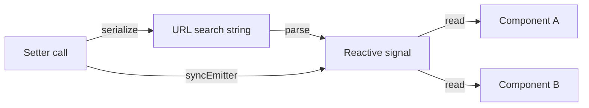

URL query state lets you store application state directly in the URL search string — so users can share links, bookmark pages, and navigate with the browser's back button while your UI stays in sync. `createQueryState` and `createQueryStates` expose that state as ordinary SolidJS signals.

## How it works

When you call `createQueryState`, it reads the current URL, parses the relevant search parameter, and returns a reactive accessor/setter pair. Every write goes through the history API (`pushState` or `replaceState`) and notifies every other component that holds the same key — no prop drilling or global store required.



## `createQueryState`

`createQueryState` manages a single URL parameter. It mirrors the `createSignal` API: it returns `[accessor, setter]`, where the accessor is a zero-argument function you call to read the current value reactively.

```typescript
import { createQueryState, parseAsString, parseAsInteger } from "./nuqs";

// Without a default — accessor returns string | null
const [name, setName] = createQueryState("name", parseAsString);

// With a default — accessor always returns a string (never null)
const [count, setCount] = createQueryState(
  "count",
  parseAsInteger.withDefault(0),
);
```

### Return type

```typescript
export type CreateQueryStateReturn<T, Default> = [
  () => Default extends undefined ? T | null : T,
  (
    value: null | T | ((old: Default extends T ? T : T | null) => T | null),
    options?: Options,
  ) => void,
];
```

The accessor's return type narrows automatically:

- **No `defaultValue`** — returns `T | null`. The key may be absent from the URL.
- **With `defaultValue`** — returns `T`. The accessor falls back to the default when the key is absent.

### Reading the value

Call the accessor inside JSX or a reactive computation. SolidJS tracks the dependency automatically.

```tsx
function Greeting() {
  const [name] = createQueryState("name", parseAsString);

  return <p>Hello, {name() ?? "anonymous visitor"}!</p>;
}
```

### Setting the value

The setter accepts three forms:

```typescript
// Set a concrete value
setName("Ada");

// Remove the key from the URL entirely
setName(null);

// Functional updater — receives the current value
setCount((prev) => (prev ?? 0) + 1);
```

You can also pass per-call `Options` as a second argument to override the parser's defaults for a single update:

```typescript
setCount(42, { history: "push" });
```

## `createQueryStates`

`createQueryStates` batches multiple parameters under a single accessor/setter pair. This is useful for related state (filters, pagination) that should update atomically.

```typescript
import { createQueryStates, parseAsString, parseAsInteger } from "./nuqs";

const [filters, setFilters] = createQueryStates(
  {
    search: parseAsString.withDefault(""),
    page: parseAsInteger.withDefault(0),
  },
  { history: "replace" },
);

// Read individual fields
filters().search; // string
filters().page;   // number

// Partial updates — only the listed keys change
setFilters({ page: filters().page + 1 });

// Functional updater
setFilters((prev) => ({ page: prev.page + 1 }));

// Clear all keys
setFilters(null);
```

<Note>
`setFilters` only updates the keys you pass. Keys you omit in a partial object are left unchanged in the URL.
</Note>

### URL key aliasing

If you want a different URL parameter name than your state key, pass `urlKeys`:

```typescript
const [state, setState] = createQueryStates(
  { currentPage: parseAsInteger.withDefault(0) },
  { urlKeys: { currentPage: "p" } }, // URL uses ?p=1
);
```

## Null and default values

The accessor returns `null` when the key is absent from the URL **and** no `defaultValue` was provided. With a `defaultValue`, the accessor returns the default instead of `null`.

Setting a value to `null` removes the key from the URL:

```typescript
const [name, setName] = createQueryState("name", parseAsString);
setName(null); // ?name=... is removed from the URL
```

### `clearOnDefault`

When `clearOnDefault` is `true` (the default), setting a value equal to `defaultValue` also removes the key from the URL. This keeps URLs clean — the default state is represented by the absence of the parameter, not `?count=0`.

```typescript
const [count, setCount] = createQueryState(
  "count",
  parseAsInteger.withDefault(0),
);

setCount(0); // URL: (key removed, same as default)
setCount(5); // URL: ?count=5
```

Set `clearOnDefault: false` to always write the value to the URL:

```typescript
const [count, setCount] = createQueryState("count", {
  ...parseAsInteger.withDefault(0),
  clearOnDefault: false,
});

setCount(0); // URL: ?count=0
```

## Cross-component sync

All components that call `createQueryState` (or `createQueryStates`) with the same key share state through a module-level `syncEmitter`. When one component updates the value, the emitter fires synchronously and every other subscriber updates its signal — no re-parsing required.

```tsx
// ComponentA.tsx
function ComponentA() {
  const [count, setCount] = createQueryState("count", parseAsInteger.withDefault(0));
  return <button onClick={() => setCount((c) => c + 1)}>+</button>;
}

// ComponentB.tsx — stays in sync automatically
function ComponentB() {
  const [count] = createQueryState("count", parseAsInteger.withDefault(0));
  return <p>Count: {count()}</p>;
}
```

<Tip>
Because sync is handled via a shared emitter rather than the URL round-trip, components reflect the new value immediately — even before the history API call completes.
</Tip>

## Built-in parsers

Parsers define how values are serialized to and deserialized from the URL string. nuqs ships several built-in parsers:

<AccordionGroup>
  <Accordion title="Primitive parsers">
    | Parser | URL representation | Parsed type |
    |---|---|---|
    | `parseAsString` | `?key=hello` | `string` |
    | `parseAsInteger` | `?key=42` | `number` |
    | `parseAsFloat` | `?key=3.14` | `number` |
    | `parseAsBoolean` | `?key=true` | `boolean` |
    | `parseAsHex` | `?key=ff` | `number` |
    | `parseAsIndex` | `?key=1` (1-based) | `number` (0-based) |
  </Accordion>
  <Accordion title="Date parsers">
    | Parser | URL representation | Parsed type |
    |---|---|---|
    | `parseAsTimestamp` | `?key=1712345678000` | `Date` |
    | `parseAsIsoDateTime` | `?key=2024-04-05T12:00:00.000Z` | `Date` |
    | `parseAsIsoDate` | `?key=2024-04-05` | `Date` |
  </Accordion>
  <Accordion title="Enum and literal parsers">
    ```typescript
    // String literal union
    const [tab, setTab] = createQueryState(
      "tab",
      parseAsStringLiteral(["overview", "settings", "billing"] as const),
    );

    // String enum
    enum Status { Active = "active", Inactive = "inactive" }
    const [status, setStatus] = createQueryState(
      "status",
      parseAsStringEnum(Object.values(Status)),
    );

    // Number literal
    const [size, setSize] = createQueryState(
      "size",
      parseAsNumberLiteral([10, 25, 50, 100] as const),
    );
    ```
  </Accordion>
  <Accordion title="Array parser">
    ```typescript
    // Comma-separated by default
    const [tags, setTags] = createQueryState(
      "tags",
      parseAsArrayOf(parseAsString),
    );
    // ?tags=foo,bar,baz → ["foo", "bar", "baz"]

    // Custom separator
    const [ids, setIds] = createQueryState(
      "ids",
      parseAsArrayOf(parseAsInteger, "|"),
    );
    // ?ids=1|2|3 → [1, 2, 3]
    ```
  </Accordion>
</AccordionGroup>

### Custom parsers

Use `createParser` to define your own serialization:

```typescript
import { createParser } from "./nuqs";

const parseAsDate = createParser({
  parse: (value: string) => {
    const date = new Date(value);
    return isNaN(date.getTime()) ? null : date;
  },
  serialize: (date: Date) => date.toISOString().slice(0, 10),
});

const [date, setDate] = createQueryState("date", parseAsDate);
```

## Complete example

```tsx
import { createQueryState, createQueryStates, parseAsString, parseAsInteger } from "./nuqs";

function SearchPage() {
  const [name, setName] = createQueryState("name", parseAsString);
  const [count, setCount] = createQueryState(
    "count",
    parseAsInteger.withDefault(0),
  );
  const [filters, setFilters] = createQueryStates({
    search: parseAsString.withDefault(""),
    page: parseAsInteger.withDefault(0),
  });

  return (
    <>
      <input
        value={name() ?? ""}
        onInput={(e) => setName(e.currentTarget.value || null)}
        placeholder="Your name"
      />
      <button onClick={() => setName(null)}>Clear</button>

      <p>Count: {count()}</p>
      <button onClick={() => setCount((c) => c + 1)}>+</button>
      <button onClick={() => setCount(null)}>Remove from URL</button>

      <input
        value={filters().search}
        onInput={(e) => setFilters({ search: e.currentTarget.value })}
        placeholder="Search..."
      />
      <p>Page: {filters().page}</p>
      <button onClick={() => setFilters({ page: filters().page + 1 })}>
        Next page
      </button>
    </>
  );
}
```
